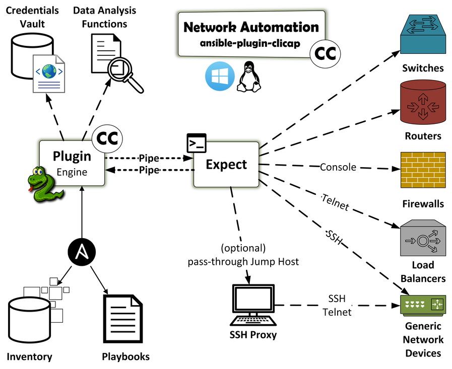

.. index::
   single: Workflow Diagram

============
Introduction
============

The plugin collects (captures) command-line (cli) output from and
interacts with network equipment.

The intended audience of this plugin are system and network
administrators and engineers.

The plugin *will* (in near future) work on both Windows and Linux
operating systems.

The plugin's data abstraction format is `YAML <http://yaml.org/>`__.

The plugin requires the presence of two binaries: ``ssh`` and
``expect``.

Workflow Diagram
----------------

|Plugin Workflow|

